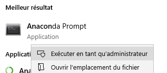
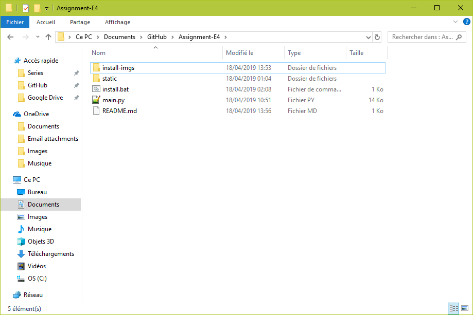
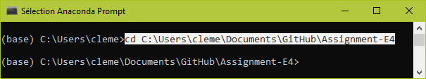
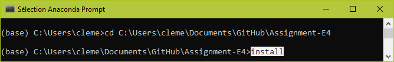
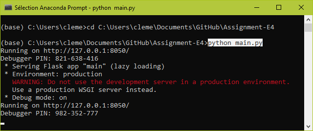
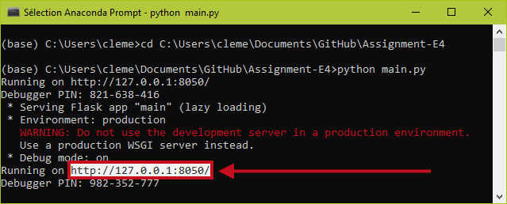
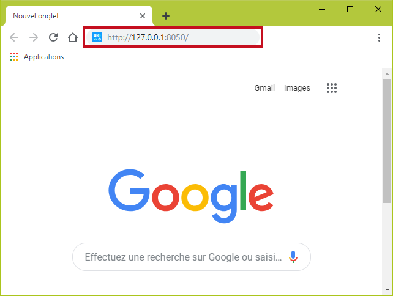

# Assignment-E4
An assignment algorithm for E4 students
## Requirements
- Windows
- Anaconda distribution
## Installation
First open the Anaconda prompt as an admin.\
\

\
\
\
Then make your way to the project folder.\
\

\
\
\
Then set it as the current working directory in your anaconda prompt.\
\

\
\
\
Then run ```install```.\
\

\
\
You are done !
## Get Gurobi license
Each year you will have to request and download a gurobi license in order to run the program.\
[Here](https://www.gurobi.com/documentation/8.1/quickstart_mac/retrieving_a_free_academic.html#subsection:academiclicense) is a quick tutorial on how to get and install this license.\
If you forget to install the license, you will see it on the anaconda prompt once you have run the server and hit the 'Compute' button.
## Run the program
First open the Anaconda prompt as an admin, then set the project folder as the current working directory.\
\

\
\
\
Then run ```python main.py```.\
\

\
\
\
A flask server has just been created ! It's hosted on the address shown below.\
\

\
\
\
Now just copy and paste this adress in your favorite web browser !\
\
